```{r setup, include=FALSE}
knitr::opts_chunk$set(echo = TRUE)
knitr::include_graphics
```

# Abstract

This project presents an analysis of the monthly revenue of Taiwanese Semiconductor Manufacturing Company (TSMC) using time series models. Specifically, three different models, namely SARIMA, Holt-Winters, and FB Prophet, were compared to determine their forecasting performance. Evaluation metrics such as Mean Absolute Error (MAE), Root Mean Square Error (RMSE), Mean Absolute Percentage Error (MAPE), and Mean Absolute Scaled Error (MASE) were employed for model comparison. The objective was to select the best-performing model based on these metrics and provide an accurate revenue forecast for the next quarter. The analysis began with a comprehensive exploration of TSMC's monthly revenue data, examining trends, seasonality, and other patterns that could impact revenue. Subsequently, the SARIMA, Holt-Winters, and FB Prophet models were trained using historical revenue data. The performance of each model was evaluated using the aforementioned metrics, enabling the assessment of accuracy and robustness in capturing revenue patterns. By comparing the results, the model that yielded the most accurate forecasts for TSMC's revenue was the SARIMA model. The selected model was then used to forecast revenue for the upcoming year, providing valuable insights for stakeholders such as investors, analysts, and decision-makers. The research paper also highlights the strengths and limitations of each model, contributing to the field of time series analysis and offering a foundation for further research in revenue forecasting and related domains.

# Introduction

The ability to accurately forecast revenue is of utmost importance for companies seeking to make informed business decisions, plan strategies, and meet financial objectives. Time series analysis provides a valuable framework for understanding and predicting patterns in sequential data, making it a suitable approach for revenue forecasting. In this project paper, we focus on the monthly revenue of Taiwanese Semiconductor Manufacturing Company (TSMC) and aim to compare the forecasting performance of three popular time series models: SARIMA, Holt-Winters, and FB Prophet.

The first step in our analysis involves an exploration of TSMC's monthly revenue data, obtained from TSMC's website. This exploration aims to identify any underlying trends, seasonality, or other patterns that might influence the revenue. By understanding these patterns, we can better select and evaluate appropriate models for revenue forecasting.

We then proceed to train the SARIMA, Holt-Winters, and FB Prophet models using the available historical revenue data. These models are widely used in time series analysis and offer different approaches for capturing the dynamics of revenue patterns. To compare their performance, we employ evaluation metrics such as Mean Absolute Error (MAE), Root Mean Square Error (RMSE), Mean Absolute Percentage Error (MAPE), and Mean Absolute Scaled Error (MASE). These metrics allow us to assess the accuracy and robustness of each model in capturing revenue patterns and make an informed selection of the best-performing model.

Upon identifying the best model, we utilize it to forecast TSMC's revenue for the next quarter. This forecast provides valuable insights for stakeholders, including investors, analysts, and decision-makers, enabling them to gain a better understanding of TSMC's future financial performance. The findings of our study can aid in making informed decisions regarding TSMC's financial strategies and serve as a foundation for further research in the domain of time series forecasting.

| Date       | Objective                                              | Outcome                                                                                                         | Delegated Tasks                                                                                    |
|------------------|------------------|-------------------|------------------|
| 06-05-2023 | Plan a timeline and set a schedule and decide company  | We will be applying the principles of time series analysis to understand the revenue of TSMC                    | Read an example research paper (TSA of Jute demand) and collect the revenue data of TSMC           |
| 10-05-2023 | Discuss the research paper                             | Built an understanding of how research is done                                                                  | Make a list of TS models which could be used.                                                      |
| 15-05-2023 | Discuss potential TS models                            | One modern model will be compared against classical models                                                      | List down the Advantages, disadvantages, and use cases for each model. Find customers of TSMC      |
| 18-05-2023 | Discuss the collected model's                          | Classical models finalized - Seasonal ARIMA and Exponential Smoothing models                                    | Collect the data regarding companies that buy from TSMC                                            |
| 23-05-2023 | Finalize the modern model                              | LSTM model finalized                                                                                            | Find appropriate determinants for comparison between models and read a case study for LSTM         |
| 26-05-2023 | Discuss the LSTM case study and possible determinants  | RMSE, MAE, MAPE, and MASE will be used to compare models while AICc value will be used to select the parameters | Implement the Seasonal ARIMA models and the ES models.                                             |
| 29-05-2023 | Discuss the Classical models' fit and share some plots | Log[revenue] will be used for analysis                                                                          | Calculate AICc values and finalize model parameters in SARIMA models and ES models                 |
| 02-06-2023 | Discuss the final two models                           | Finalized - SARIMA[4,1,1][1,0,2][12] and Holt Winters' Additive Model                                           | Implement LSTM Model                                                                               |
| 05-06-2023 | Discuss LSTM                                           | The LSTM model does not fit well                                                                                | Try to make a better LSTM model and find another modern model                                      |
| 12-06-2023 | Discuss changing the model                             | Discarded LSTM model and presented the Prophet model                                                            | Read about the prophet model and find case studies implementing this model in the field of finance |
| 15-06-2023 | Discuss the case studies                               | More study required before implementing this model                                                              | List down the problems in the LSTM model and how can the Prophet model be better                   |
| 19-06-2023 | Discuss more case studies and finalize the model       | Finalized the Prophet model                                                                                     | Implement the prophet model and read the history of TSMC company                                   |
| 22-06-2023 | Discuss CV techniques                                  | Cross-Validation using the Rolling Origin method will be used                                                   | Implement Cross-Validation and compare the models                                                  |
| 26-06-2023 | Share the results of the CV                            | The prophet model is the best                                                                                   | Make a report draft and considered publishing our results                                          |
| 04-07-2023 | Share the final Report                                 | Made important changes to the report                                                                            | Submit the supplementary folder with the final report                                              |

: Outline and proceedings of the project.

# Literature Review

The field of forecasting in various industries has seen significant advancements in recent years, with researchers exploring different quantitative models and techniques to improve the accuracy and reliability of predictions. Four research papers contribute to this field by focusing on different aspects of forecasting and evaluating the performance of various models.

In 2016 Jana Fabianová\*, Peter Kačmáry, Vieroslav Molnár, and Peter Michalik$^{[2]}$ focused on addressing data uncertainty in sales forecasting. The researchers utilized historical data, probabilistic modeling techniques, and the SARIMA model to generate realistic and robust sales forecasts. By considering data uncertainty, the tool enhanced forecast accuracy and aided in decision-making processes by providing a range of potential outcomes. This study highlighted the advantages of incorporating data uncertainty in sales forecasting and demonstrates the effectiveness of probabilistic modeling techniques. In 2017, C. L. Karmaker, P. K. Halder and E. Sarker$^{[1]}$ investigated the application of quantitative forecasting models for predicting the demand for jute yarn. By comparing models such as simple moving average, single exponential, double exponential (Holt's), Winters, and decomposition methods, the researchers aimed to determine the most effective model. They evaluated the models using error determinants like mean absolute deviation (MAD), mean absolute percentage error (MAPE), and mean square deviation (MSD). The study provided a comprehensive analysis of these models on a weekly basis over a four-year period, allowing for a detailed examination of their forecasting performance. In 2017 Serkan ARAS , İpek DEVECİ KOCAKOÇ, and Cigdem POLAT$^{[3]}$ presented a comparative study of single and combination forecasting methods for predicting retail sales. Various forecasting methods, including time series models, regression analysis, and machine learning algorithms, were applied to historical sales data. Statistical tests, model selection using the Akaike Information Criterion corrected (AICc), and residual analysis were employed to evaluate and compare the forecasting methods. The study provided insights into the strengths and limitations of both single and combination methods in the context of retail sales forecasting, using appropriate error metrics for performance evaluation.Finally in 2020, Emir Žunić, Kemal Korjenić, Kerim Hodžić and Dženana Đonko$^{[4]}$ focused on the application of Facebook's Prophet algorithm for accurate sales forecasting based on real-world data. The researchers employed the Prophet algorithm, which handles time series forecasting with seasonality and trends. The algorithm captured different components of the sales data and generated probabilistic forecasts with uncertainty intervals. The study showcased the algorithm's capabilities in handling complex time series patterns and provided insights into its performance using error metrics. It emphasized the algorithm's practicality and potential benefits for businesses in terms of improved decision-making and resource allocation.

Overall, these four papers contributed to the field of forecasting by evaluating different quantitative models and techniques for various industries. They highlighted the importance of accurate forecasting in optimizing business processes and decision-making. The studies emphasized the need to consider data uncertainty, evaluate multiple models, and employ appropriate error metrics for performance evaluation. Our study draws inspiration from these research papers to add valuable insights and practical guidance for researchers and practitioners in the field of forecasting

# Methodology

We begin by reviewing the basics of time series analysis and create a basis for understanding the various times series models used in this project.

## Time Series Analysis

A time series is a collection of observations or data points measured and recorded sequentially over regular time intervals. Formally, a time series can be defined as an ordered sequence of data points represented as Yt, where t denotes the time index and Yt represents the observed value or measurement at a time "t". The time series data can be discrete or continuous, depending on the nature of the variable being measured.

In a time series, the observations are typically recorded at equidistant time intervals, such as hourly, daily, monthly, or yearly. The data points are often influenced by various factors, including seasonality, trends, cyclic patterns, and random fluctuations. These characteristics make time series analysis a valuable tool for understanding and predicting future behaviour based on past patterns and trends.

Time series analysis involves studying the properties, patterns, and dynamics of the data, as well as developing mathematical models and statistical techniques to capture and explain its behaviour.

## Definitions

1.  *Data Point*: A data point refers to a single observation or measurement recorded at a specific time point in a time series.
2.  *Time Interval*: A time interval is a duration between successive time points or observations in a time series. It represents the granularity or frequency at which the data is collected or recorded.
3.  *Lag*: Lag refers to the time distance between two observations in a time series.
4.  *Autocorrelation*: Autocorrelation measures the linear relationship between the values of a variable in a time series at different time lags. It helps identify the presence of any serial dependence or correlation between observations.
5.  *Autocorrelation function (ACF)*: ACF measures the linear dependence between an observation and its lagged values. The ACF plots shows autocorrelation coefficients at different lags, indicating how past values at those lags can predict future values.
6.  *Partial autocorrelation function (PACF)*: PACF measures the direct relationship between an observation and its lagged values while considering intermediate lags. The PACF plots shows partial autocorrelation coefficients at various lags, revealing significant direct relationships without the influence of intervening lags.
7.  *Unit root*: A unit root in a time series refers to a characteristic where the series exhibits a random trend and does not revert to a constant mean over time. In other words, the series does not show a tendency to converge towards a specific average value or exhibit stationarity.
8.  *Forecasting*: Forecasting involves predicting or estimating future values or patterns of a variable in a time series based on historical data. It aims to capture and project the underlying behaviour and trends in the data.
9.  *Forecast Horizon*: Refers to the time duration into the future for which predictions are generated in a time series analysis. It indicates the length of the forecasted values beyond the present or the last observed data point and helps determine the timeframe for decision-making and planning based on the forecasted information.
10. *Homoscedasticity*: Homoscedasticity refers to the property of a time series where the variance of the errors or residuals remains constant or consistent across different time periods i.e. the variability of the data points in the series does not change systematically over time.

## Components of a Time Series

In time series analysis, a series is often decomposed into several components that collectively capture the different patterns and variations present in the data. The main components of a time series are: 

1.  *Trend*: The trend component represents the long-term pattern or direction of the data. It indicates whether the variable is increasing, decreasing, or following a relatively stable pattern over time. The trend can be linear, nonlinear, or even non-existent.
2.  *Seasonality*: Seasonality refers to the repetitive and predictable patterns that occur within a time series at regular intervals, typically within a year or a shorter period. These patterns may be influenced by seasonal factors, such as weather, holidays, or economic cycles. Seasonality can be additive or multiplicative, depending on whether the magnitude of the seasonal pattern remains constant or varies with the level of the series. 
3.  *Cyclical* *patterns*: The cyclical component captures the irregular patterns or fluctuations in a time series that are not of fixed period or related to specific calendar effects. These cycles are typically longer than the seasonal cycles and can be influenced by economic, business, or geopolitical factors. Cyclical patterns are often associated with boom and bust cycles, but their duration and magnitude can vary. 
4.  *Irregularity* or *Residual*: The irregular component, also referred to as the residual or error component, represents the random or unpredictable fluctuations that cannot be explained by the other components. It encompasses any noise, randomness, or unexplained variation in the time series data.
5.  *Level*: Level refers to the underlying or average behaviour of the data over time, which is often incorporated into the trend component and is not typically considered a distinct component of a time series.

## Stationarity

Stationarity is a property of a time series where the statistical properties, such as mean, variance, and covariance, remain constant over time. A stationary time series exhibits stable behaviour and is often easier to model and analyse compared to non-stationary series. 

Here are some key reasons why stationarity is desirable:

1.  Simplified Modelling: Stationary time series exhibit consistent statistical properties over time, such as constant mean, constant variance, and autocovariance that depends only on the time lag. This simplifies the modelling process by allowing us to assume that the statistical properties of the data remain constant throughout the series. Modelling a stationary series is often easier and more straightforward compared to non-stationary series.
2.  Predictability: Stationary time series exhibit stable and predictable behaviour. The patterns observed in the past are likely to persist in the future, making it easier to forecast future values based on historical data. Stationary series allow for reliable extrapolation and forecasting using mathematical models, such as autoregressive integrated moving average (ARIMA)
3.  Interpretability: Stationarity enables the identification and interpretation of the underlying patterns and dynamics within a time series. By removing trends and seasonality through differencing or other transformations, the focus can be shifted to the cyclical or residual components, allowing for a better understanding of the true underlying behaviour of the data.

**Tests for checking stationarity**

When a time series has a unit root, it implies that the series is non-stationary, and its statistical properties, such as mean and variance, are not constant over time. Instead, the series may exhibit trends, cycles, or other patterns that can make it challenging to analyze or model accurately.

1.  *Augmented Dickey-Fuller (ADF) Test*: The ADF test is a widely used test for stationarity. It assesses whether a unit root is present in a time series, indicating non-stationarity. The null hypothesis of the test is that the series has a unit root (i.e., it is non-stationary). If the p-value associated with the ADF test is below a chosen significance level (e.g., 0.05), the null hypothesis is rejected, indicating stationarity.

2.  *Kwiatkowski-Phillips-Schmidt-Shin (KPSS) Test*: The KPSS test is another commonly employed test for stationarity. It examines whether a time series is trend-stationary or difference-stationary. The null hypothesis of the KPSS test is that the series is trend-stationary. If the p-value is above a specified significance level, the null hypothesis is not rejected, indicating stationarity.

**Methods to make time series stationary**

To make a time series stationary, you can employ various methods and transformations. The specific approach you choose depends on the characteristics of the data and the nature of the non-stationarity. Here are some common methods for making a time series stationary: 

1.  *Differencing*: Differencing involves taking the difference between consecutive observations in the time series. This method is effective for removing a trend or linear component. If the series exhibits a constant growth rate, you can apply first-order differencing (subtracting each observation from its previous observation). For higher-order differencing, you can repeat the differencing process multiple times until the series becomes stationary. 
2.  *Logarithmic* *transformation*: If the series displays exponential growth or varying variance over time, applying a logarithmic transformation can stabilise the variance and make the series more stationary. Taking the natural logarithm of the series values helps in reducing the magnitude of large values and dampening the exponential growth.
3.  *Seasonal* *differencing*: Seasonal differencing involves taking the difference between observations at a fixed seasonal interval. This method is useful for removing seasonal patterns or periodic fluctuations. By subtracting the observation from the corresponding observation in the previous season, you can eliminate the seasonal component and potentially achieve stationarity. 
4.  *Miscellaneous* *transformation* *techniques*: Certain mathematical transformations can help stabilize the variance of a time series. For example, the Box-Cox transformation can be applied to handle cases where the variance of the series changes with the level. This transformation applies a power function to the series, allowing for different types of transformations depending on the chosen parameter $\lambda$.

The choice of method depends on the specific characteristics and behaviour of the time series. Additionally, after applying the transformation or differencing, it is crucial to assess the stationarity of the resulting series using statistical tests, such as the Augmented Dickey-Fuller (ADF) test.

## Residuals

Residuals are the differences between the observed values of a time series and the corresponding predicted values from a forecasting model. Residuals are an essential component in time series analysis and modelling.

**Properties of Residuals**

1.  *Mean* *Zero*: The residuals should have an average value close to zero. A non-zero mean may indicate a systematic bias in the model.

2.  *Independence*: Residuals should be independent of each other. Autocorrelation in residuals suggests that the model fails to capture the temporal dependencies in the data.

3.  *Homoscedasticity*: Residuals should exhibit constant variance over time. Heteroscedasticity, where the variance of residuals varies with the level of the series, may indicate model inadequacy.

4.  *Normally* *Distributed*: Residuals should follow a normal distribution. Departure from normality may affect the validity of statistical inference and prediction intervals.

**Ljung-Box test**

The Ljung-Box test examines the presence of autocorrelation in the residuals. If the test results indicate significant autocorrelation, it suggests that the model may need further refinement or consideration of additional explanatory variables.

The Ljung--Box test is defined as:

$H_0$ : The data are independently distributed (i.e. the correlations in the population from which the sample is taken are 0, so that any observed correlations in the data result from randomness of the sampling process).

$H_a$: The data are not independently distributed; they exhibit serial correlation.

The test statistic is $$Q=n(n+2) \sum_{k=1}^{h}{\frac{\sigma_k^2}{n-k}}$$ where $n$ is the sample size $\sigma_k$ is the sample autocorrelation at lag $k$,and $h$ is the number of lags being tested. Under $H_0$ the statistic $Q$ asymptotically follows a $χ^{2}_{h}$. For significance level $\alpha$, the critical region for rejection of the hypothesis of randomness is $$Q>\chi^2_{1-\alpha,h}$$ where $\chi^2_{1-\alpha,h}$ is the $(1 − \alpha)$-quantile of the chi-squared distribution with $h$ degrees of freedom. The Ljung--Box test is commonly used in autoregressive integrated moving average (ARIMA) modelling. When testing the residuals of an estimated ARIMA model, the degrees of freedom need to be adjusted to reflect the parameter estimation. For example, for an$ARIMA(p, 0, q)$ model, the degrees of freedom should be set to $h-p-q$.

## Determinants and Information Criteria

Errors in time series forecasting refer to the differences between the predicted values and the actual observed values of the time series. Errors provide a direct evaluation of the forecasting accuracy and help assess the performance of different forecasting models. Lower error values indicate better accuracy and closer alignment with the actual data.

Information criteria, such as the Akaike Information Criterion (AIC) and the Bayesian Information Criterion (BIC), are statistical measures used to compare and select between different competing models. These criteria aim to balance the goodness of fit of the model with the complexity or number of parameters used in the model. Information criteria penalise models with a higher number of parameters, encouraging parsimony and avoiding overfitting. The lower the information criterion value, the better the trade-off between model fit and complexity.

Some commonly used errors and information criteria are:

1\. RMSE

:   It provides a measure of the standard deviation of the forecast errors and is sensitive to larger errors.$$ \sqrt{\frac{1}{n} \sum_{i=1}^{n}{(Y_i - \hat{Y_i})^2}} $$

2\. MAE

:   It gives an indication of the average magnitude of the forecast errors in the original scale of the data.

    $$ \frac{1}{n}\sum_{i=1}^{n}{|Y_i-\hat{Y}_i|} $$

3\. MAPE

:   It provides an understanding of the average magnitude of the forecast errors relative to the actual values.

    $$ \frac{1}{n}\sum_{i=1}^{n}{\frac{Y_i-\hat{Y_i}}{Y_i}\cdot100} $$

4\. MASE

:   It provides a relative measure of accuracy, which is helpful when comparing forecast performance across different time series.$$ \frac{1}{n}\sum_{i=1}^{n}{\frac{|Y_i-\hat{Y_i}|}{\frac{1}{T-m}\sum_{t=m+1}^{n}|Y_t-Y_{t-m}|}} $$

5\. AIC

:   Given a collection of models for the data, AIC estimates the quality of each model, relative to each of the other models. Thus, AIC provides a means for model selection.$$ 2k-\log(L(\theta)) $$

6\. AICc

:   It is equal to AIC with a correction for small sample sizes. The formula for AICc depends upon the statistical model. Assuming that the model is univariate, is linear in its parameters, and has normally-distributed residuals (conditional upon regressors), then the formula for AICc is as follows. $$AICc  = AIC + \frac{2k^2+2k}{n-k-1} $$

7\. BIC

:   It generally penalizes free parameters more strongly than the AIC, though it depends on the size of $n$ and relative magnitude of $n$ and $k$. $$k\ln(n) - 2\log(L(\theta))$$

where $n$ denotes the sample size, $Y_i$ denotes the $i^{th}$ timestamp, $\hat{Y_i}$ denotes the forcast for the $i^{th}$ timestamp, $m$ denotes the seasonal period, $k$ denotes the number of parameters in the model and $L(\theta)$ denotes the likelihood of the model.

## Cross Validation

Cross-validation is a technique used to evaluate the performance and generalise the effectiveness of a predictive model. It involves partitioning the available dataset into subsets, typically a training set and a validation set, and iteratively training and evaluating the model on different combinations of these subsets. 

The basic steps of cross-validation are as follows: 

1.  Splitting the dataset: The original dataset is divided into k subsets or folds of approximately equal size. 

2.  Model training and evaluation: The model is trained on k-1 folds of the data, and the remaining fold is used for validation. This process is repeated k times, with each fold serving as the validation set once. 

3.  Performance metrics: The performance of the model is assessed on each validation set, and the evaluation results (such as accuracy, mean squared error, or other relevant metrics) are recorded. 

4.  Aggregating results: The performance metrics from each iteration are averaged or combined to obtain an overall assessment of the model's performance. 

The main purpose of cross-validation is to estimate how well a model will perform on unseen data. It helps to assess the model's ability to generalise and identifies potential issues such as overfitting or underfitting. By using different subsets of the data for training and validation, cross-validation provides a more robust evaluation of the model's performance compared to a single train-test split. 

Commonly used cross-validation methods include k-fold cross-validation, stratified k-fold cross-validation, leave-one-out cross-validation, and holdout validation. The choice of the cross-validation method depends on the size of the dataset, the nature of the problem, and other considerations.

In this study, We are using a rolling origin Method for cross validation

Rolling origin cross-validation, also known as rolling window or sliding window cross-validation, is a variation of the traditional cross-validation technique. It is commonly used in time series analysis and forecasting to assess the performance of predictive models on sequential data. 

In rolling origin cross-validation, a fixed-size training window is defined, and the model is trained on the observations within this window. The model is then tested on the next observation that immediately follows the training window, which serves as the validation or test set. This process is repeated by sliding the window one step forward and retraining the model, generating new predictions and evaluating their performance at each step. Figure 1 shows a visual representation of this method.

The main steps involved in rolling origin cross-validation are as follows: 

1.  Set the initial training window: Determine the size of the training window, which typically consists of a fixed number of sequential observations. 

2.  Train and evaluate the model: Train the model on the data within the training window. Use the model to make predictions for the next observation in the sequence, which serves as the validation set. Evaluate the performance of the model based on the prediction accuracy or relevant metrics. 

3.  Slide the window: Move the training window one step forward by removing the earliest observation and including the next observation in the sequence. Retrain the model using the updated training window, make predictions for the next observation, and evaluate the model's performance again. 

4.  Repeat the process: Repeat steps 2 and 3 until the training window reaches the end of the available data, generating predictions and performance evaluations at each step. 

Rolling origin cross-validation allows for the assessment of a model's performance on sequential data, which is crucial in time series analysis and forecasting. It provides a more realistic evaluation of the model's ability to generalise to future observations by simulating the real-world forecasting scenario where the model is updated and retrained as new data becomes available. This approach helps to capture changes in the underlying patterns or dynamics of the time series over time and provides a more accurate representation of the model's performance compared to traditional cross-validation methods that assume independent and identically distributed samples.

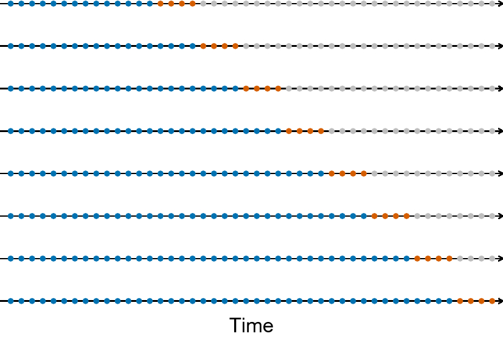{width="1019" height="375"}

## Models

Although there are many models which are used in time series analysis, this project mainly focuses on the most popular ones (SARIMA and Holt-Winters) and the most recent ones ( FB Prophet)

### Naive Model

The naive model is one of the simplest and most basic approaches for time series forecasting. It assumes that the future values of a time series will be the same as the most recent observed value. In other words, the naive model assumes that there is no trend, seasonality, or any other pattern in the data, and the future values will simply be a repetition of the last observed value.

The naive model is straightforward and quick to implement, but it is highly simplistic and assumes that the future behaviour of the time series will be the same as the most recent observation. It doesn't account for any underlying patterns, trends, or seasonality in the data, so its accuracy is often limited. However, it can serve as a baseline model for comparison against more sophisticated forecasting methods.

Equation: $$ Y_{t}\ = \ Y_{t - 1}\ $$

### ARIMA

ARIMA is a class of models which was developed by combing the smaller and simpler models togather.

#### Autoregressive (AR)

The AR model assumes that the current value of a variable is a linear combination of its previous values and a random error term.

We refer to the following equation as the $AR(p)$ modelan autoregressive Model of order $p$, where $p$ determines the number of lagged terms considered in the model.

$Y_{t} = c + \phi_{1}Y_{t - 1} + \phi_{2}Y_{t - 2} + \cdots +$ $\ \phi_{p}Y_{t - p} + \varepsilon_{t} ,\ \varepsilon_{t}\text{ is white noise.}$

Parameter Constraints for stationary data for an $AR(1)$ model $-1<\phi_{1}<1$ . For an $AR(2)$ model $− 1 < \phi_{2} < 1$, $\phi_{1}+ \phi_{2}<1 , \phi_{2} − \phi_{1}<1$

#### Moving Average (MA)

A moving average model forecasts the future values of a time series based on the weighted average of past error terms. It assumes that the current value of the series depends on the past error terms and a random error term. The order of the moving average model, denoted as $MA(q)$, specifies the number of lagged error terms considered in the model.

$Y_{t} = c + \varepsilon_{t} + \theta_{1}\varepsilon_{t - 1} + \theta_{2}\varepsilon_{t - 2} + \cdots$ $\theta_{q}\ \varepsilon_{t - q}\ ,\ \varepsilon_{t}\ \text{is white noise.}$

Parameter Constraints for stationary data for an $MA(1)$ model is $-1<\theta_{1}<1$ and for an $MA(2)$ model is $-1<\theta_{1}<1$, $\theta_{1}$ $+\theta_{2}<1$ , $\theta_{2}$ $-\theta_{1}<1$.

It is important to note that the MA model assumes stationarity of the time series, meaning that the mean and variance of the series remain constant over time. If the time series exhibits non-stationarity, pre-processing techniques such as differencing can be applied to make it stationary before fitting the MA model.

#### Autoregressive Moving Average (ARMA)

The ARMA (Autoregressive Moving Average) model is a popular time series model that combines the autoregressive (AR) and moving average (MA) components to capture both the linear dependence on past values and the influence of past error terms.

The full $ARMA(p,q)$ can be written as:

$p$ = order of the autoregressive component, specifying the number of lagged terms of the dependent variable included in the model.

$q$ = order of the moving average component, specifying the number of lagged error terms included in the model.

$Y_{t} = c + \phi_{1}Y_{t - 1} + \phi_{2}Y_{t - 2} + \cdots\  +$ $\phi_{p}Y_{t - p} + \varepsilon_{t} + \theta_{1}\varepsilon_{t - 1} + \theta_{2}\varepsilon_{t - 2} + \cdots\ \theta_{q}\varepsilon_{t - q}$

#### Autoregressive Integrated Moving Average (ARIMA)

The ARIMA model incorporates the autoregressive component (AR) to capture the linear dependence on past values, the differencing component (I) to achieve stationarity, and the moving average component (MA) to capture the influence of past error terms.

The full $ARIMA (p,d,q)$ model can be written as:

$Y'_{t} = c + \phi_{1}{Y'}_{t - 1} + \phi_{2}{Y'}_{t - 2} + \cdots\  + \phi_{p}{Y'}_{t - p} + \varepsilon_{t} + \theta_{1}\varepsilon_{t - 1} + \theta_{2}\varepsilon_{t - 2} + \  \cdots \  + \theta_{q}\varepsilon_{t - q}$

${Y'}_{t}$ is the differenced series.

$p$ and $q$ are order of the autoregressive component and order of the moving average component respectively.

$d$ = degree of differencing, indicating the number of times the data needs to be differenced to achieve stationarity.

#### Seasonal Autoregressive Integrated Moving Average (SARIMA)

The SARIMA model is an extension of the ARIMA model that incorporates seasonal patterns in time series data. It is used to capture both the non-seasonal and seasonal components of a time series.

The SARIMA model is denoted as $SARIMA(p, d, q)(P, D, Q)[m]$, where $p,\ d,\ q,\ P,\ D,\ Q, \text{ and }m$ represents the order of the non-seasonal autoregressive component, the degree of non-seasonal differencing, the order of the non-seasonal moving average component, the order of the seasonal autoregressive component, the degree of seasonal differencing, the order of the seasonal moving average component, and the length of the seasonal cycle respectively.

### Exponential Smoothing

Exponential smoothing is a time series forecasting method that assigns exponentially decreasing weights to past observations. It is a simple and widely used technique for generating short-term forecasts.

The basic idea behind exponential smoothing is to assign different weights to past observations, with more recent observations receiving higher weights and older observations receiving lower weights. The weights decrease exponentially as the observations become more distant in the past. This approach reflects the assumption that more recent observations are more relevant and carry more information for predicting future values.

Exponential smoothing involves three main components:

1.  *Level*: The level represents the smoothed value of the time series at a particular time point. It is calculated by taking a weighted average of the current observation and the previous level. The weight assigned to the current observation is typically denoted as alpha ($\alpha$ ), and the weight assigned to the previous level is denoted as 1 - $\alpha$ . The level is updated recursively as new observations become available.
2.  *Trend*: If there is a trend present in the data, exponential smoothing can also incorporate a trend component. The trend represents the change in the level over time. It is calculated by taking a weighted average of the difference between the current level and the previous level (slope). Similar to the level, the trend is updated recursively using weights. The weight assigned to the current slope is denoted as beta ($\beta$), and the weight assigned to the previous trend is denoted as 1 - $\beta$.
3.  *Seasonality*: In some cases, exponential smoothing can also handle seasonality, which refers to repeating patterns in the data that occur over fixed intervals, such as daily, weekly, or yearly patterns. Seasonal exponential smoothing incorporates seasonal adjustments to the forecasts by considering the seasonal indices. The seasonal indices represent the average deviation from the overall level at each seasonal period. These indices are applied to adjust the forecasts based on the seasonality observed in the historical data.

There are different variations of exponential smoothing methods, including simple exponential smoothing, double exponential smoothing (which includes a trend component), and triple exponential smoothing (which includes both trend and seasonality components). The appropriate method to use depends on the characteristics of the time series data and the patterns observed.

Exponential smoothing is a relatively simple technique to implement and can provide reasonable forecasts for short-term predictions. However, it may not capture complex patterns or long-term trends as effectively as other more sophisticated forecasting methods.

#### Simple Exponential Smoothing

For simple exponential smoothing, the only component included is the level, $l_{t}$ . (Other methods which are considered later in this chapter may also include a trend $b_{t}$ and a seasonal component $s_{t}$ .) Component form representations of exponential smoothing methods comprise a forecast equation and a smoothing equation for each of the components included in the method. The component form of simple exponential smoothing is given by:

Forecast Equation: $\hat{Y}_{t + h} = l_{t}$

Level Equation: $l_{t}\  = \ \alpha Y_{t}\  + (1 - \alpha)l_{t - 1}$

Here $\hat{Y}_{t}$ denotes the forecasted value at time t, and $Y_{t}$ denotes the observed value at time t.

#### Holts' Method

Holt (1957) extended simple exponential smoothing to allow the forecasting of data with a trend. This method involves a forecast equation and two smoothing equations (one for the level and one for the trend):

Forecast Equation: $\hat{Y}_{t + h} = \ l_{t} + hb_{t}$

Level Equation: $l_{t\ } = \alpha Y_{t} + (1 - \alpha)(l_{t - 1} + b_{t - 1})$

Trend Equation: $b_{t} = \beta(l_{t} - l_{t - 1}) + (1 - \beta)b_{t - 1}$

where $l_{t}$ denotes an estimate of the level of the series at a time$\ t$, $b_{t}$ denotes an estimate of the trend (slope) of the series at a time $t,\ \alpha$ is the smoothing parameter for the level, and $\beta$ is the smoothing parameter for the trend ̣

#### **Holt-Winters Model**

Holt (1957) and Winters (1960) extended Holt's method to capture seasonality. The Holt-Winters seasonal method comprises the forecast equation and three smoothing equations --- one for the level $l_{t}$ , one for the trend $b_{t}$ , and one for the seasonal component $s_{t}$ , with corresponding smoothing parameters $\alpha$ , $\beta$, and $\gamma$. Let $m$ denote the frequency of the seasonality, i.e., the number of seasons in a year. For example, for quarterly data $m = 4$, and for monthly data $m=12$.

There are two variations to this method that differ in the nature of the seasonal component. The additive method is preferred when the seasonal variations are roughly constant through the series, while the multiplicative method is preferred when the seasonal variations are changing proportionally to the level of the series. With the additive method, the seasonal component is expressed in absolute terms in the scale of the observed series, and in the level equation, the series is seasonally adjusted by subtracting the seasonal component. Within each year, the seasonal component will add up to approximately zero. With the multiplicative method, the seasonal component is expressed in relative terms (percentages), and the series is seasonally adjusted by dividing through by the seasonal component. Within each year, the seasonal component will sum up to approximately m.

1.  **Additive Method**

    Forecast Equation: $\hat{Y}_{t + h} = l_{t} + hb_{t} + s_{t + h - m(k + 1)}$

    Level Equation: $l_{t} = \alpha(Y_{t} - s_{t - m}) + (1 - \alpha)(l_{t - 1} - b_{t - 1})$

    Trend Equation: $b_{t} = \beta(l_{t} - l_{t - 1}) + (1 - \beta)b_{t - 1}$

    Seasonality Equation: $s_{t} = \gamma(Y_{t} - l_{t - 1} - b_{t - 1}) + (1 - \gamma)s_{t - m}$\
    where k is the integer part of $\frac{h - 1}{m}$.

2.  **Multiplicative Method**

    Forecast Equation: $\hat{Y}_{t + h} = (l_{t} + hb_{t})s_{t + h - m(k + 1)}$

    Level Equation: $l_{t} = \alpha\frac{Y_{t}}{s_{t - m}} + (1 - \alpha)(l_{t - 1} + b_{t - 1})$

    Trend Equation: $b_{t} = \beta(l_{t} - l_{t - 1}) + (1 - \beta)b_{t - 1}$

    Seasonality Equation:$s_{t} = \gamma\frac{y_{t}}{l_{t - 1} + b_{t - 1}} + (1 - \gamma)s_{t - m}$

### LSTM

LSTM (Long Short-Term Memory) is a type of recurrent neural network (RNN) architecture that is commonly used for time series analysis, including the analysis of univariate data.

In the context of time series analysis, an LSTM model is designed to capture and analyse patterns and dependencies in sequential data over time. It is particularly effective when dealing with long-term dependencies in the data, as it can remember information over longer periods compared to traditional RNNs.

The key idea behind LSTM is the use of memory cells that allow the model to selectively retain or forget information at each time step. These memory cells are responsible for capturing and preserving relevant information from the past and propagating it forward in the sequence. The LSTM model achieves this through the use of three main components:

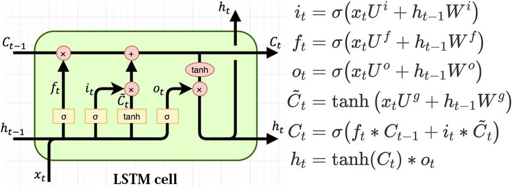

1.  *Cell* *State*: The cell state is the long-term memory of the LSTM. It runs straight through the entire sequence, and the LSTM can selectively add or remove information from it using gates. The cell state acts as a conveyor belt, allowing information to flow while preserving relevant information.
2.  *Forget* *Gate*: The forget gate determines which information from the previous time step shou ld be discarded from the cell state. It takes as input the current input and the previous hidden state and outputs a value between 0 and 1 for each element of the cell state. A value of 0 indicates that the corresponding element should be forgotten, while a value of 1 indicates that it should be retained.
3.  *Input* *Gate* and *Output* *Gate*: The input gate and output gate control the flow of information into and out of the memory cell. The input gate determines which values from the current time step should be updated in the cell state, while the output gate controls which values from the cell state should be used to compute the output of the LSTM.

Using these gates and memory cells, an LSTM model can effectively capture long-term dependencies in time series data. During training, the model learns the optimal parameters for the gates and the memory cells by minimising a loss function that measures the model's performance in predicting the target values.

In the context of univariate time series analysis, an LSTM model takes the past values of a single variable as input and predicts the future values of that variable. It can be trained on a historical sequence of data and then used to forecast future values based on the learned patterns and dependencies in the data.

Overall, LSTM models have proven to be powerful tools for time series analysis, enabling accurate predictions and capturing complex temporal patterns in univariate data.

### Prophet

Prophet is a forecasting model developed by Facebook's Core Data Science team. It is designed to handle time series data with various components such as trends, seasonality, and holiday effects. Prophet utilises an additive model that decomposes the time series into its constituent parts and models them separately.

The Prophet model incorporates the following components:

1.  *Trend*: Prophet captures both short-term and long-term trends in the data. It employs a piecewise linear or logistic growth curve to model non-linear changes in the trend.

    -   Linear - A linear trend refers to a pattern in the data where the values increase or decrease steadily and consistently over time or across a range of observations.

    -   Logistic - A logistic trend refers to a pattern in the data where the values initially increase or decrease rapidly, but eventually level off or reach a plateau. It is commonly observed in situations where there are limiting factors or constraints on the growth or decline of a variable. The logistic trend is characterised by an initial exponential-like growth or decline, followed by a gradual flattening of the curve.

2.  *Seasonality*: Prophet accounts for recurring patterns in the data, such as weekly, monthly, or yearly seasonality. It uses Fourier series to model these seasonal components.

3.  *Holidays*: Prophet incorporates the impact of holidays or important events that may affect the time series. It allows users to provide a custom list of holidays or automatically detects holidays based on country-specific datasets.

4.  *Error*: Prophet assumes that the observed time series is a combination of trend, seasonality, and noise. It models the residual errors using a non-parametric approach based on historical data.

Equation of the Prophet Model is:

$Y(t) = g(t) + s(t) + h(t) + e(t)$.

where $g(t)$: trend, $s(t)$: seasonality, $h(t)$: holiday effects, and $e(t)$: error term/noise

Prophet offers several advantages for time series forecasting:

1.  Flexibility: It can handle time series data with irregular gaps, missing values, and outliers.

2.  Automatic changepoint detection: Prophet automatically detects changepoints in the trend, allowing for capturing abrupt changes in the time series.

3.  Intuitive model interpretation: Prophet provides clear and interpretable visualisations, including trend, seasonality, and holiday effects, enabling users to understand the underlying patterns.

4.  Scalability: Prophet can handle large-scale time series datasets efficiently and can be parallelized for faster computation.

To use the Prophet model, users need to provide a historical time series dataset with a timestamp column and a corresponding value column. Prophet then fits the model to the data, estimates the model parameters, and provides forecasts for future time points.

# TSMC

TSMC (Taiwan Semiconductor Manufacturing Company) is a global leader in semiconductor manufacturing and the world's largest dedicated independent semiconductor foundry. Established in 1987, TSMC has played a pivotal role in shaping the technology landscape and driving innovation in the semiconductor industry.

As a foundry, TSMC specialises in the fabrication of advanced semiconductor products for a wide range of applications, including consumer electronics, automotive, telecommunications, and industrial devices. The company's cutting-edge manufacturing processes enable the production of high-performance chips, delivering enhanced computational power, energy efficiency, and miniaturisation.

Most of the leading fabless semiconductor companies such as AMD, Apple, ARM, Broadcom, Marvell, MediaTek, Qualcomm, and Nvidia, are customers of TSMC, as are emerging companies such as Allwinner Technology, HiSilicon, Spectra7, and UNISOC.

## Data and Insights

All datasets utilised in this project were sourced exclusively from the official website of TSMC, ensuring data authenticity and reliability. The dataset employed for time series analysis comprises monthly revenue data spanning from January 1999 to April 2023. The revenue values are reported in units of 1 billion NTD (New Taiwanese Dollar).

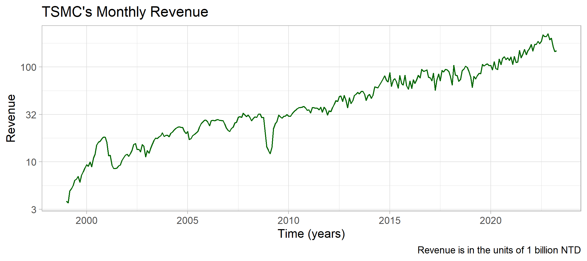

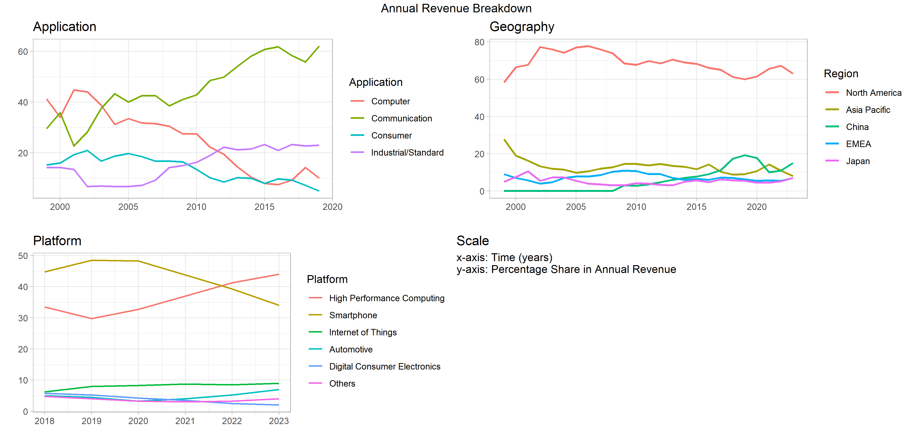


# Analysis and Results

Initially, we extract valuable insights from the plotted data. As depicted in Figure 3, the monthly revenue exhibits an approximately linear trend when visualised on a logarithmic scale. This observation leads us to consider employing models that assume a linear trend in the data, such as ARIMA, Holt Winters, and FB Prophet. For the purpose of analysis, we adopt a logarithmic transformation using a base of 10.

## SARIMA

Let us denote our original revenue time series by $R_{t}$ . We have 292 data points from January 1999 to April 2023 hence $t \in \left\{ 1,\ 2,\ .\ .\ .\ 292 \right\}$. In order to fit the SARIMA model we first need to make the time series stationary. As mentioned earlier we take log of $R_{t}$ to get $Y_{t} = \log_{10}(R_{t})$. We apply a first order differencing to $Y_{t}$ to get $Z_{t} = Y_{t} - Y_{t - 1}$.

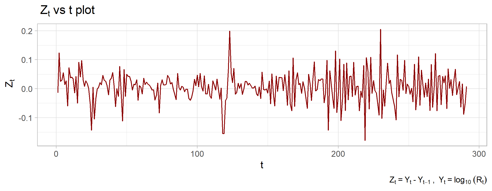

We perform the ADF test on $Z_{t}$ with lag order 24 to check if we have acheived stationarity or not. The p-value returned is 0.01 therefore we reject the null hypothesis of non-stationariy. Hence in the SARIMA model the order of differencing $d = 1$ and the order of seasonal differencing $D=0$. Now to find the value of $p, P, Q, \text{and } q$ we look at the ACF and PACF plots. The PACF plot shows the direct correlation between $Z_{t}$ and $Z_{t - k}$ where k is the number of lags. The largest $k$ for which the PACF value is significantly different from zero gives a good measure for the value of $p$. The ACF plot shows the direct correlation for $Z_{t}$and $Z_{t - k}$. The largest $k$ for which the ACF value is significantly different from zero gives a good measure of $q$. $P,\text{ and } Q$are also found similarly. Since some correlation might arise from random chance and may not reflect the underlying data generation process we have to consider multiple values for $p$ and $q$ and then select the best. AICc value is used to choose the best model.

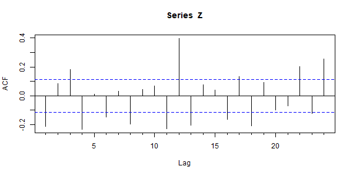

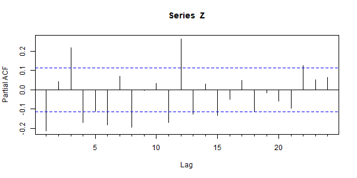

The spike in the PACF plot at lag = 12 suggests that the seasonal period $m$ is 12. Using the plots we guess that $p\  \in \ \{ 1,\ 3,\ 4\}$ , $q\  \in \{ 1,\ 3,\ 4\}$, $D \in \{ 0\}$, $P \in \{ 1\}$, $Q \in \{ 0,1,\ 2\}$. Now we take all possible combinations of $p, q,$ and $Q$ and calculate the AICc value for each of them.

The values of $p, q,$ and $Q$ which minimise AICc are 4, 1, and 2 respectively. Hence the SARIMA model that we get is $SARIMA(4,1,1)(1,0,2)[12]$.

|       | $\phi_1$ | $\phi_2$ | $\phi_3$ | $\phi_4$ | $\theta_1$ | $\phi_{12}$ | $\theta_{12}$ | $\theta_{24}$ |
|--------|:-------|:-------|:-------|:-------|:-------|:-------|:-------|:-------|
| Value | 0.8218   | 0.1028   | 0.2128   | -0.3186  | -0.9289    | 0.9892      | -0.7017       | -0.2032       |
| S.D.  | 0.0672   | 0.0749   | 0.0746   | 0.0571   | 0.0387     | 0.0216      | 0.0814        | 0.0783        |

: Parameters of the SARIMA model.

In order to get the final model equation we need to find out which coefficients are statistically different from 0. If the value of the coefficients is within two standard deviations of 0 then we say that that coefficient is statistically equivalent to 0 hence we will not include it in the model equation. We find that ar2 should not be included.

$Z_{t} = 0.822\ Z_{t - 1} + 0.213\ Z_{t - 3} - 0.319{\ Z}_{t - 4} - 0.929\ \varepsilon_{t - 1} + 0.989\ Z_{t - 12} - 0.702\ \varepsilon_{t - 12} - 0.203\ \varepsilon_{t - 24}$

$Y_{t} = Z_{t} + Y_{t - 1}$

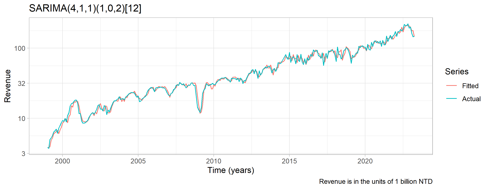

If our model is good then the residuals should be IID normal random variables i.e. white noise. Ljung-Box test with the number of lags = 24 on our residuals gives us a p-value of 0.36 which shows that the residuals are in fact white noise.

## Holt-Winters

Following the same procedure as in the SARIMA model we fit our model on $Z_{t}$. We use the same seasonal period = 12. The smoothing parameter $\alpha,\ \beta,$ and $\gamma$ are estimated by minimising the mean squared error.

$\alpha = 0.0008$, $\beta = 0.0008$, $\gamma = 0.0485$.

The initial values are calculated as:   
$l_{12} = mean(Z_{1}, Z_{13}, \dots) ,\ b_{12} = mean(\frac{Z_{13} - Z_{1}}{12}, \frac{Z_{14} - Z_{2}}{12} ,\dots) , s_{i} = Z_{i} - l_{12} ,\forall \ i \ \in \ \{1,\ 2, \dots 12\}$

$\forall\ t\  > \ 12,$

$l_{t} = \alpha(Z_{t} - s_{t - 12}) + (1 - \alpha)(l_{t - 1} - b_{t - 1})$

$b_{t} = \beta(l_{t} - l_{t - 1}) + (1 - \beta)b_{t - 1}$

$s_{t} = \gamma(Z_{t} - l_{t - 1} - b_{t - 1}) + (1 - \gamma)s_{t - 12}$

$Z_{t} = l_{t - 1} + b_{t - 1} + s_{t - 12}$

$Y_{t} = Z_{t} + Y_{t - 1}$

|          |          |        |        |          |          |          |
|----------|----------|:-------|:-------|:---------|:---------|:---------|
| $l_{12}$ | $b_{12}$ | $s_1$  | $s_2$  | $s_3$    | $s_4$    | $s_5$    |
| 0.0111   | -0.003   | 0.0071 | -0.029 | -0.029   | 0.019    | -0.0064  |
|          |          |        |        |          |          |          |
| $s_6$    | $s_7$    | $s_8$  | $s_9$  | $s_{10}$ | $s_{11}$ | $s_{12}$ |
| 0.026    | 0.0061   | 0.014  | 0.019  | -0.0099  | 0.048    | -0.064   |

: Parameters of the Holt-Winters model.


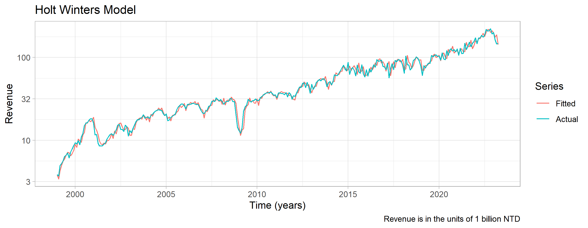

## Prophet

The trend component of the Prophet model is modelled as a piecewise linear function of time. At each changepoint, the trend changes direction. The trend equation is defined as follows:

$g(t) = (k + a(t)) \cdot t + d$ where $g(t)$ : the trend value at time $t$, $k$ : overall growth rate of the trend, $a(t)$ : adjustment for each changepoint, and $d$ : offset parameter, capturing the overall level of the time series.

Yearly Seasonality Equation : $$s_{y}(t)\ = \ (A_{j}\ \frac{\cos((2\pi t\ j)}{P})\ + \ B_{j\ }\ \frac{\sin((2\pi t\ j)}{P})\ $$

where $s_y(t)$ represent the yearly seasonality values at time $t$.

$A_{j},\ B_{j}$ are the respective coefficients for the seasonal components.

$P$ is the user-defined period for the yearly seasonality (e.g.365.25 for daily data).

The final forecasted value is obtained by summing the trend, seasonality, and holiday components:

$y(t) = \ g(t) + s_{y}(t) + h(t) + \ \varepsilon$ where: $y(t)$ is the forecasted value at time t and $\varepsilon$ is the error term accounting for noise and variability in the time series.

The model is fitted on $Z_{t}$ with growth set to 'linear' and seasonality mode set to additive.

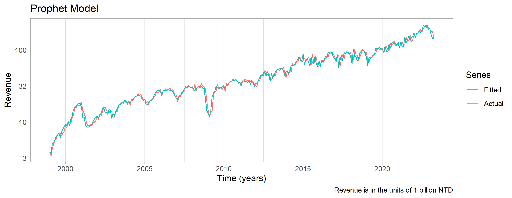

## Cross Validation

The objective of our study is to identify the most effective model for predicting revenue for the upcoming quarter, specifically targeting a 3-month forecasting horizon. To evaluate the performance of the models, we have adopted the rolling forecast origin cross-validation technique. This technique involves a systematic process of training and testing the models using sequential time periods.The methodology can be summarized as follows:

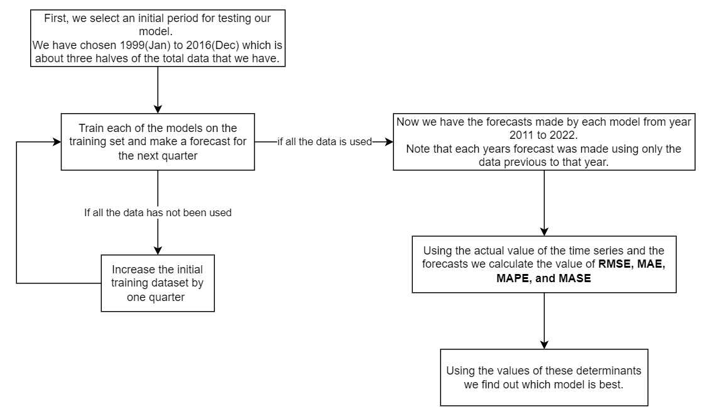

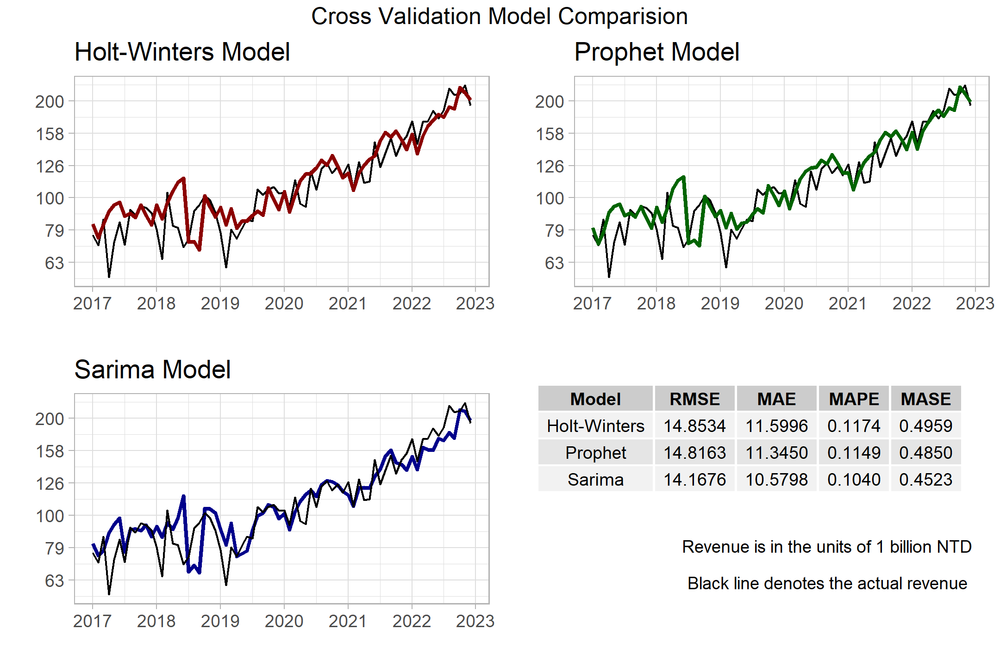

\newpage

# Conclusion

Based on the analysis and evaluation of all four determinants, it is evident that the Prophet model does not outperform the other two models, namely Holt-Winters and SARIMA. However, it is important to acknowledge that this study is limited to a specific context, focusing on predicting the future monthly revenue of TSMC for a 3-month period.

It should be recognized that the performance of the Prophet model may vary depending on the particular time series under analysis and the forecasting period considered. Different datasets and forecasting objectives might yield different results. Therefore, the findings of this study cannot be generalised to all scenarios and must be interpreted within the scope of this specific investigation. Further research and experimentation are necessary to explore the performance of different models across diverse datasets and forecast scenarios.

Considering the specific case of predicting the future monthly revenue of TSMC for a 3-month period, the SARIMA model emerges as the superior choice compared to both Holt-Winters and the Prophet model. The SARIMA model demonstrated better accuracy and reliability in forecasting revenue for the given timeframe.

Finally we make the prediction for the next quarter using the Sarima model

| Month-Year | Revenue Point Estimate | 90 % Confidence Interval |
|:-----------|:-----------------------|--------------------------|
| May 2023   | 150.5297               | (123.4459, 183.5556)     |
| June 2023  | 144.7664               | (110.9622, 188.8689)     |
| July 2023  | 155.2020               | (112.5692, 213.9810)     |

: Forecast for the next quarter using the SARIMA model.

*\*Revenue is in the units of 1 billion NTD*

# References

$^{[1]}$*C. L. Karmaker, P. K. Halder and E. Sarker* "A Study of Time Series Model for Predicting Jute Yarn Demand: Case Study" ,Journal of Industrial Engineering, Volume 2017

$^{[2]}$*Jana Fabianová\*, Peter Kačmáry, Vieroslav Molnár, and Peter Michalik* "Using a Software Tool in Forecasting: a Case Study of Sales Forecasting Taking into Account Data Uncertainty" ,DE GRUYTER OPEN, 2016

$^{[3]}$*Serkan ARAS , İpek DEVECİ KOCAKOÇ, Cigdem POLAT "COMPARATIVE STUDY ON RETAIL SALES FORECASTING BETWEEN SINGLE AND COMBINATION METHODS"* Journal of Business Economics and Management, 2017 Volume 18(5): 803--832.

$^{[4]}$*Emir Žunić, Kemal Korjenić, Kerim Hodžić and Dženana Đonko* "APPLICATION OF FACEBOOK'S PROPHET ALGORITHM FOR SUCCESSFUL SALES FORECASTING BASED ON REAL-WORLD DATA" International Journal of Computer Science & Information Technology (IJCSIT) Vol 12, No 2, April 2020
